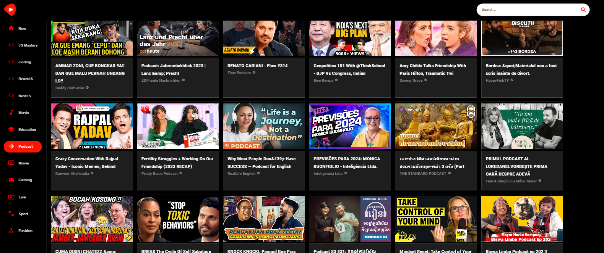

# Youtube clone App

Aplikace v Reactu inspirovaná aplikací Youtube.

Fetchování dat z online API: [RapidAPI Youtube v3](https://rapidapi.com/ytdlfree/api/youtube-v31?utm_source=youtube.com%2FJavaScriptMastery&utm_medium=referral&utm_campaign=DevRel)

## Spuštění aplikace

### `npm start`

Spustí aplikaci v development módu.\
Otevři [http://localhost:3000](http://localhost:3000) pro zobrazení spuštěné aplikace.

## Ukázka aplikace

